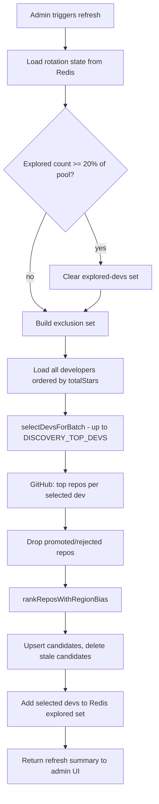

# Candidate discovery algorithm

This document explains how **Refresh repos** works in the admin panel. Each refresh rebuilds the `candidate` queue by scanning GitHub repos from a rotating slice of Chilean developers, then ranking those repos with a regional bias so underrepresented areas get a fair shot.

Implementation lives in:

- [`discovery.service.ts`](./discovery.service.ts) — orchestration and persistence
- [`discovery-ranking.ts`](./discovery-ranking.ts) — pure selection/ranking helpers
- [`discovery-explored-devs.store.ts`](./discovery-explored-devs.store.ts) — Redis-backed dev rotation state

## Goals

The algorithm is designed to solve three problems that plagued the old “top 300 devs by stars every time” approach:

1. **Stale candidates** — the same popular repos were re-selected while already promoted, so refreshes produced few new items.
2. **Regional imbalance** — regions with many promoted repos (e.g. Metropolitana) dominated every batch; quieter regions rarely surfaced.
3. **Limited coverage** — only a tiny fraction of the ~44k indexed developers were ever considered.

The new flow rotates through the **full developer pool**, temporarily skips developers already explored in this rotation cycle, and biases both dev and repo picks toward regions with fewer promoted repos.

## End-to-end flow



## Configuration

All values can be overridden per refresh request (admin API) or via environment variables.

| Setting | Env var | Default | Meaning |
|--------|---------|---------|---------|
| Devs per refresh | `DISCOVERY_TOP_DEVS` | `300` | How many developers to pull into this batch |
| Repos per dev | `DISCOVERY_REPOS_PER_DEV` | `10` | Top starred repos fetched from GitHub per dev |
| Regional picks | `DISCOVERY_TOP_PER_REGION` | `10` | Max repos selected per Chilean region |
| National picks | `DISCOVERY_TOP_COUNTRY` | `50` | Max repos in the nationwide ranking |
| Rotation fraction | `DISCOVERY_DEV_ROTATION_FRACTION` | `0.2` | Fraction of full dev pool explored before reset |
| Featured dev cap | `DISCOVERY_FEATURED_REPO_CAP` | `2` | Skip devs with this many promoted repos |
| Explored TTL | `DISCOVERY_EXPLORED_DEVS_TTL_HOURS` | `24` | Redis key TTL for rotation state |

Example: with ~44,000 developers and `0.2`, the rotation resets after **8,782** unique devs have been explored (`floor(43911 × 0.2)`).

## Step 1 — Developer rotation (Redis)

Redis key: `discovery:explored-devs` (SET of GitHub user IDs)

On each refresh:

1. Read how many devs are in the explored set (`SCARD`).
2. If `exploredCount >= floor(totalDevelopers × rotationFraction)`, **reset** the set and start a new rotation cycle.
3. Load all explored IDs into an exclusion set.
4. After a successful refresh, **add** every dev selected in this batch (`SADD`) and refresh the key TTL.

The TTL (default 24h) means rotation state survives redeploys but eventually expires if nobody refreshes for a while.

**Important:** the 20% threshold applies to the **full developer pool**, not the 300-dev batch size.

## Step 2 — Build exclusion sets

Two groups of developers are never selected in the current batch:

| Exclusion | Source | Reason |
|-----------|--------|--------|
| Explored devs | Redis `discovery:explored-devs` | Rotation — don’t revisit until cycle resets |
| Featured devs | DB: owners with ≥ `DISCOVERY_FEATURED_REPO_CAP` promoted repos | They already have enough representation on the map |

Featured devs are counted from `repo_candidates` where `status = 'promoted'`, grouped by `owner_github_id`.

## Step 3 — Region promoted counts

Before selecting devs or repos, the service loads how many **promoted** repos exist per `region_location_id`. This map drives all regional bias logic:

- Lower promoted count → higher priority
- Ties break by stars (devs/repos) or stable ID ordering

A developer’s region is derived from their city/region location via `resolveRegionLocationSlug`.

## Step 4 — Developer selection (`selectDevsForBatch`)

Input: the full dev pool (all developers, sorted by `totalStars` desc), minus exclusions.

Output: up to `DISCOVERY_TOP_DEVS` developers, chosen in two passes.

### Pass 1 — Regional priority with per-region cap

1. Sort eligible devs by:
   - Fewest promoted repos in their region (ascending)
   - Then `totalStars` (descending)
   - Then `githubId` (stable tie-break)
2. Walk the sorted list. For each dev, accept them only if their region has not hit the **per-region cap**:
   ```
   perRegionCap = ceil(batchSize / regionCount)
   ```
   With defaults (`300` devs, ~16 regions), that is ~19 devs per region in pass 1.

This spreads the batch across Chile instead of letting one underrepresented region fill all 300 slots.

### Pass 2 — Star-based backfill

If pass 1 does not fill `batchSize`, remaining slots are filled from the rest of the eligible pool sorted purely by `totalStars` (desc), ignoring the per-region cap.

This guarantees a full batch when enough eligible devs exist, while still prioritizing geographic diversity in pass 1.

## Step 5 — Fetch repos from GitHub

For each selected developer login, the service fetches up to `DISCOVERY_REPOS_PER_DEV` top-starred public repos via `GithubService.fetchTopRepos`.

Each repo is flattened with owner and region metadata for ranking.

## Step 6 — Filter already-decided repos

Repos whose `repo_github_id` already exists in `repo_candidates` with status `promoted` or `rejected` are removed before ranking. They will never re-enter the candidate queue.

Repos that are still `candidate` can be re-selected and updated in place.

## Step 7 — Repo ranking (`rankReposWithRegionBias`)

Eligible repos are ranked in two **overlapping** scopes. A repo can appear in both (with both `region_rank` and `country_rank` set).

### Regional picks

1. Group repos by `region_location_id`.
2. Order regions by fewest promoted repos first (same bias as dev selection).
3. Within each region, sort repos by stars (desc).
4. Take up to `DISCOVERY_TOP_PER_REGION` repos per region.
5. Assign `region_rank` = 1, 2, 3, … within that region.

### National picks

1. Sort **all** eligible repos by:
   - Fewest promoted repos in the owner’s region (asc)
   - Then stars (desc)
2. Take the top `DISCOVERY_TOP_COUNTRY` repos.
3. Assign `country_rank` = 1, 2, 3, … nationwide.
4. If a repo was already picked regionally, only its `country_rank` is added.

The union of regional and national picks becomes the new candidate set for this refresh.

## Step 8 — Persist candidates

Inside a DB transaction:

1. **Upsert** all selected repos into `repo_candidates` with `status = 'candidate'` (default), ranks, and metadata. Conflicts on `repo_github_id` update ranks and `selected_at`.
2. For any selected repo that is **already promoted**, recompute scatter map coordinates.
3. **Delete** every row with `status = 'candidate'` that was **not** in this refresh’s selection. Stale candidates are dropped; promoted and rejected rows are untouched.

After commit, selected dev GitHub IDs are written to Redis.

## Candidate lifecycle

| Status | Meaning |
|--------|---------|
| `candidate` | Awaiting admin review; replaced on next refresh unless re-selected |
| `promoted` | Visible on the public map; owner counts toward featured-dev exclusion |
| `rejected` | Permanently skipped by future refreshes |

Admin actions (`promote`, `reject`, `reset`) are handled by `DiscoveryService` and do not clear Redis rotation state.

## Refresh summary (admin UI)

The API returns a `RefreshCandidatesSummary` shown in the admin banner:

| Field | Meaning |
|-------|---------|
| `reposScanned` | Total repos returned from GitHub for this batch |
| `devsSelected` | Developers actually used in this refresh |
| `devsExcludedFeatured` | Pool size of devs skipped for having too many promoted repos |
| `totalSelected` | Repos written to the candidate queue |
| `regionPicks` / `countryPicks` | How many repos got a regional vs national rank |
| `totalCandidates` | Rows with `status = 'candidate'` after refresh |
| `promotedRetained` / `rejectedRetained` | Unchanged non-candidate rows |
| `exploredTotal` | Devs in Redis after this refresh |
| `exploredResetThreshold` | Count at which rotation resets |
| `rotationReset` | Whether this refresh cleared the explored set at the start |

## Mental model

Think of each refresh as three layered filters:

```
Full dev pool (~44k)
  → minus explored + featured devs
  → select ~300 devs (regional bias, then star backfill)
  → fetch repos
  → minus promoted/rejected repos
  → rank with regional bias (per-region + national caps)
  → replace candidate queue
  → remember explored devs in Redis
```

Over many refreshes, the system cycles through most of the indexed developer base while continuously steering new candidates toward regions that still need representation on the map.

## Tests

Unit tests cover the pure ranking/rotation helpers and the Redis store:

- [`discovery-ranking.spec.ts`](./discovery-ranking.spec.ts)
- [`discovery-explored-devs.store.spec.ts`](./discovery-explored-devs.store.spec.ts)

Run them with:

```bash
cd backend && pnpm test --testPathPattern=discovery
```
